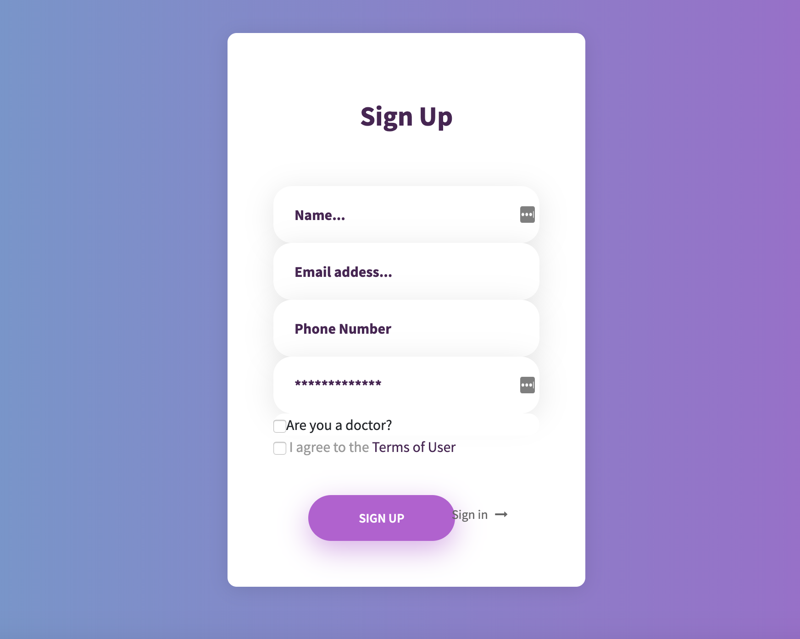

## Patient Advocacy App
Patient Advocacy is an app that allows women to track their daily symptoms. This helps to combat the feeling of belittlement of physical and mental issues when asked by a provider. This in turn helps the provider to give a more accurate diagnosis and testing if necessary.

## Technologies Used
HTML

CSS

Javascript

Node.js

express

mongodb

ejs

mongoose

body-parser

Twilio

passport

moment

## Installation
1. Clone repo
2. run `npm install`

## Usage
1. run `node server.js`or `npm run start`
2. Navigate to `localhost:5000`
